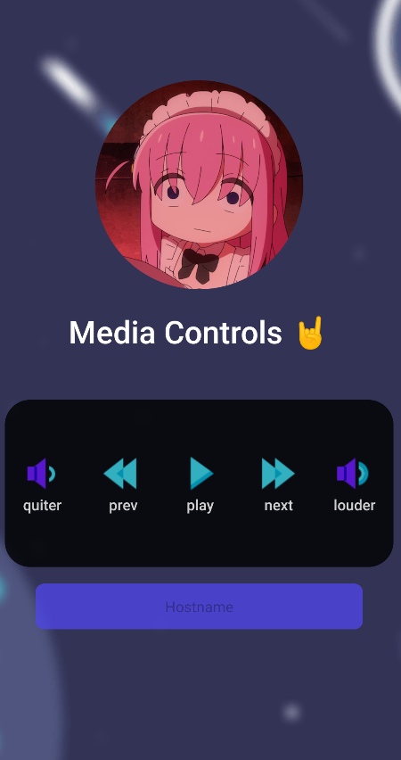

# Windows Media Control App ⏯️ 
<p>
    Full stack app that enables you to press media control keys on you windows machine such as pause/play, previous/next song from your phone
</p>

<h3>
    
    
    
    
</h3>

------

## Requirements

- Python 3
- Windows Machine
- Pc and Phone need to be in the same network

------

## Getting started 🚀

1. Clone the repository

    ```cmd
    git clone https://github.com/doniel-t/win-media-control-app.git
    ```

2. Start the server on your pc\
   Go to the ``win-media-control-app`` directory and start `startup_script.bat`\
   Its recommended to add add a script that runs this script to your autostart

    ```cmd
    .\startup_script.bat
    ```

3. Grab your hostname from the pc you want to control from your phone

    ```cmd
    hostname
    ```

4. Get the APK from [here](https://expo.dev/artifacts/eas/nNBX1nHuMPSaFDUYy3VcWX.apk) or build it yourself using an expo account
5. Install the apk on your device and run it
6. Enter your ``hostname`` in the app and try it out! 🚀
<center></center>
<center>Screenshot of the app</center>


## TODO ✅

- [x] React Native App
- [ ] Cache hostname
- [ ] Musik Notification Bar on phone
- [ ] Get song title from winapi and send it to phone
- [ ] Linux port?
  